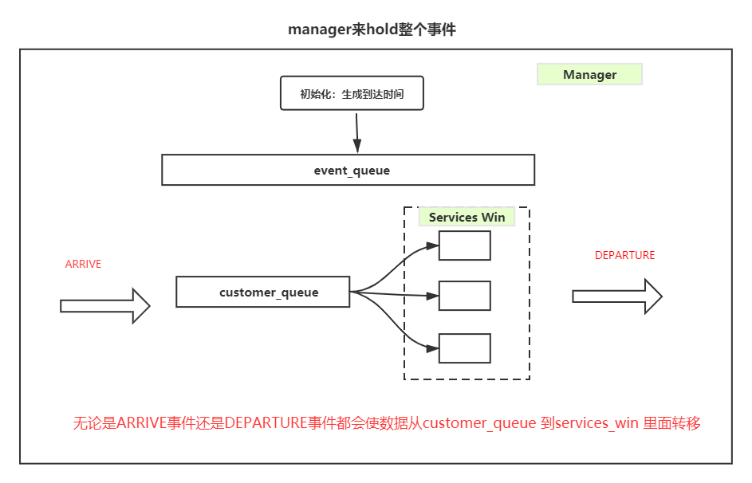

### Queue 的实现原理
queue 为了最大限度的利用空间，一般采用circular array的形式。
但是由于circular array 是利用普通array的形式进行实现的, 因此有两种情况说明这个队列是满的
（1） 一种是last iterator 在first iterator的左边
（2） 一种是first iterator 在数组的第一个位置上， last iterator 在数据的最后一个位置上.

#### Arrayqueue 的实现原理
1， enqueue：在queue没有满的情况下，  

(1) 一种是特殊情况，last已经到达最后了

(2)一种情况是，first 还没有开始
 
(3) 另一种情况是普通的情况，需要在last后面增加元素

2， dequeue:
在队列不是空队列的情况下

(1) first在最后一个位置，需要移到第一个位置 

(2) 一般情况下，first 往后移动一个位置

(3) 当last和first重合的时候，只剩下了最后一个元素，在交出元素以后， last和first重置到-1.


### Bank One Example 
英文扫盲： clerk 做文书工作的人

### 银行系统排队的问题



（1）首先要产生在某一次模拟中足量的arrive event进行处理， 在还存在event的时候
   1.1  arrive event    
   1.2  departure event
   1.3
#### 实现细节
（1） 栈和队列都属于一种特殊的数据结构，只能通过访问顶层数据并不断剔除数据的方法进行全部访问，因此没有直接的迭代器

（2） 友元进行输入输出
```c++
ostream& operator<<(ostream& _cout, Date& date)
{
	_cout << date._year << "-" << date._month << "-" << date._day;
	return _cout;
}

```

(3)

### 实现一个priority queue  

https://www.geeksforgeeks.org/priority-queue-using-linked-list/

### 如何成长成一名架构师

https://www.zhihu.com/question/40520339/answer/99790593